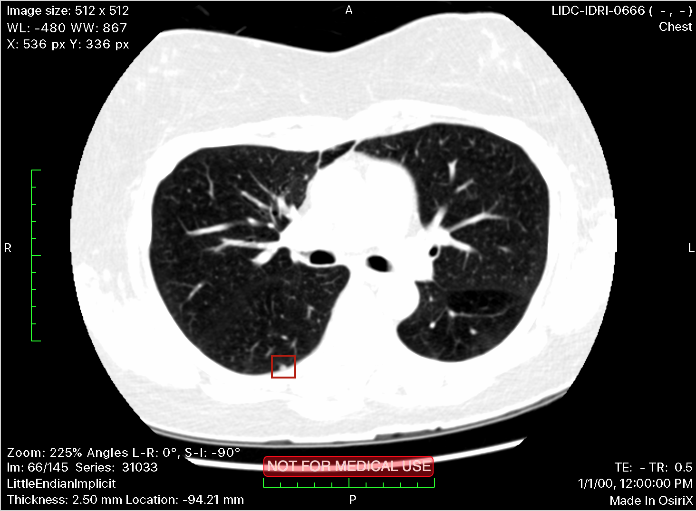
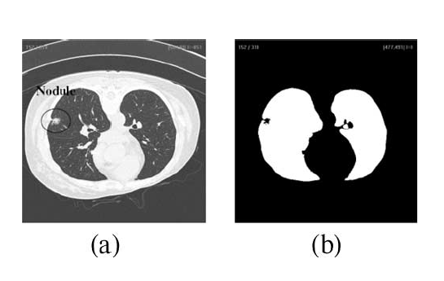
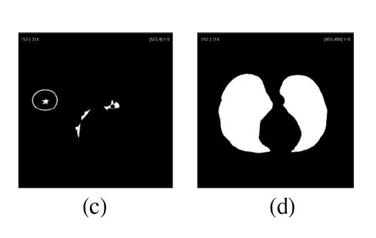
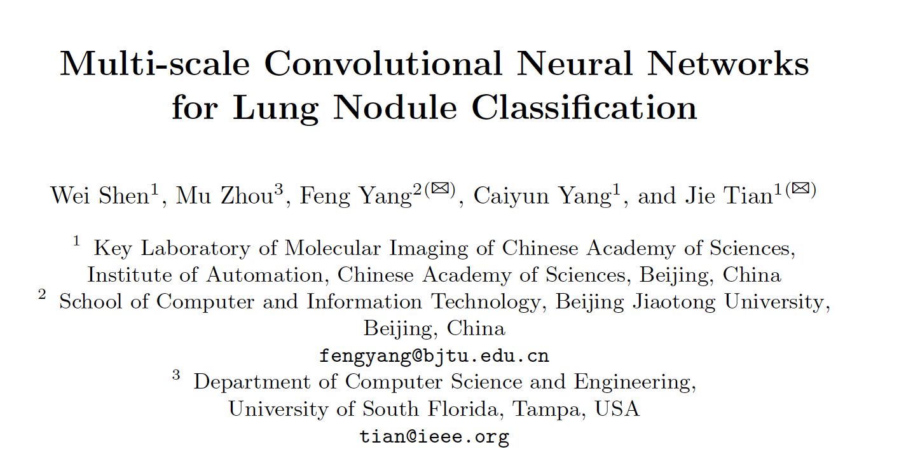

# Aided Nodule Detection in CT Scans
## Master Thesis Brainstorming
### Andrea Suckro

---

# Data

---

# Overview

- Open Dataset [LIDC-IDRI](https://wiki.cancerimagingarchive.net/display/Public/LIDC-IDRI#a30bbaec74ea46a094b9f85ae3700255) for the evaluation and training of CAD methods for lung cancer detection
- Contains 1018 cases (total of 124GB of data, 244,527 images)
- Annotation available for each case independently performed by 4 thoratic radiologists

---

# Nodule

- A lesion in the tissue with a specific morphology
- Dataset contains nodules with a diameter between 3-30mm no more than 6 per patient
- Nodules may represent primary lung cancer, metastatic disease or non-cancerous processes
- Three different classes of structures are annotated in the data

---

# Nodule >= 3mm

- Nodules with contour and features

```
      <noduleID>IL057_127581</noduleID>
      <characteristics>
        <subtlety>4</subtlety>
        <malignancy>3</malignancy>
      </characteristics>
      
      <edgeMap>
        <xCoord>103</xCoord>
        <yCoord>391</yCoord>
      </edgeMap>
 
      <imageZposition>-232.535004</imageZposition>
       
      <edgeMap>
         <xCoord>104</xCoord>
         <yCoord>393</yCoord>
      </edgeMap>
```

---

# Nodules < 3mm diameter

- Only the approximate center of mass is available

```
<unblindedReadNodule>
	<noduleID>7</noduleID>
	<roi>
	<imageZposition>-227.535004</imageZposition>
        <imageSOP_UID>1.3.6.1.4...</imageSOP_UID>
	<inclusion>TRUE</inclusion>
	<edgeMap>
	   <xCoord>127</xCoord>
	   <yCoord>370</yCoord>
	</edgeMap>
	</roi>
</unblindedReadNodule>
```

---

# Non-Nodules > 3mm  diameter

- Stored to locate structures that might be confused with nodules

```
<nonNodule>
   <nonNoduleID>2</nonNoduleID>
   <imageZposition>-92.535004</imageZposition>
   <imageSOP_UID>1.3.6.1.4...</imageSOP_UID>
	<locus>
	   <xCoord>386</xCoord>
	   <yCoord>371</yCoord>
	</locus>
</nonNodule>
```

---

# Image Data

<div style="-webkit-column-count: 2; -moz-column-count: 2; column-count: 2; -webkit-column-rule: 1px dotted #e0e0e0; -moz-column-rule: 1px dotted #e0e0e0; column-rule: 1px dotted #e0e0e0;">
	<div>
   	 
    </div>
	<div>
      <ul>
      	<li> roughly 140 images per patient (depending on slicing) </li>
        <li> 0.6 mm - 5 mm between slices </li> 
        <li> DICOM format contains additional meta information</li>
      </ul>
    </div>
</div>

---

# Current Approaches

---

# Computational Approach

- Acquisition
- Preprocessing
- Segmentation
- Nodule Detection
- Elimination of FPs

---

# Preprocessing
Everything related to improving the quality of thi images for the detection

- Filtering (Median, ... ?)
- Contrast Enhancing (Adaptive Histogram Equalization, ... ?)
- Noise Reduction (Erosion, ... ?)

---

# Segmentation

<div style="-webkit-column-count: 2; -moz-column-count: 2; column-count: 2; -webkit-column-rule: 1px dotted #e0e0e0; -moz-column-rule: 1px dotted #e0e0e0; column-rule: 1px dotted #e0e0e0;">
	<div>
   	 
   	 
    </div>
	<div>
      <ul>
      	<li> Focus only on the inner lung segments for the nodule detection </li>
        <li> Thresholding </li>
        <li> Rolling Ball Algorithm </li>  
        <li> Edge Detection </li>
        <li> ... ? </li>
      </ul>
    </div>
</div>

<span style="line-height: 1.1;font-size: 12pt; display:block"> Image: Xujiong Ye et al. Shape-based computer-aided detection of lung nodules in thoracic ct images. IEEE Transactions on Biomedical Engineering, 56(7):1810-1820, 2009</span>

---

# Nodule Detection

- juxtavascular/juxtapleural, small and ground glass nodules are hardest to detect
- Algorithms
	- spherical filters
	- local spherical properties
	- density analysis
	- clustering
	- connected component analysis

---

# Elimination of FP

- Classification of found structures by
	- Without explicit features (NN Approaches, SVMs, ...)
	- Rules (Intensity values, Morphology, Texture, Fractal)
	- Linear Discriminant Analysis
	- Markov Random Fields
	- ... ?

---

# Deep Networks

---

# Deep Neural Networks

- Apart from the had crafted pipeline of algorithms an aproach with convolutional neural networks is possible
- Some papers in this direction have already been published:
<div align='center'></div>

---

# Advantages

- The whole process of nodule detection could be represented in one network
- New features that differ from the hand-crafted ones could be learned

---
# Aspects for a thesis

- Although papers have been published that use deep networks they only focus on the performance and comparison to more established methods
- They never take a closer look at the developed features

---
# Aspects for a thesis

- Feature extraction and comparison from a trained deep network
- Do the learned features relate to traditional methods?
- Are the features stable for randomly initialized networks?
- ... ?

---
# Open Discussion / Ideas welcome!